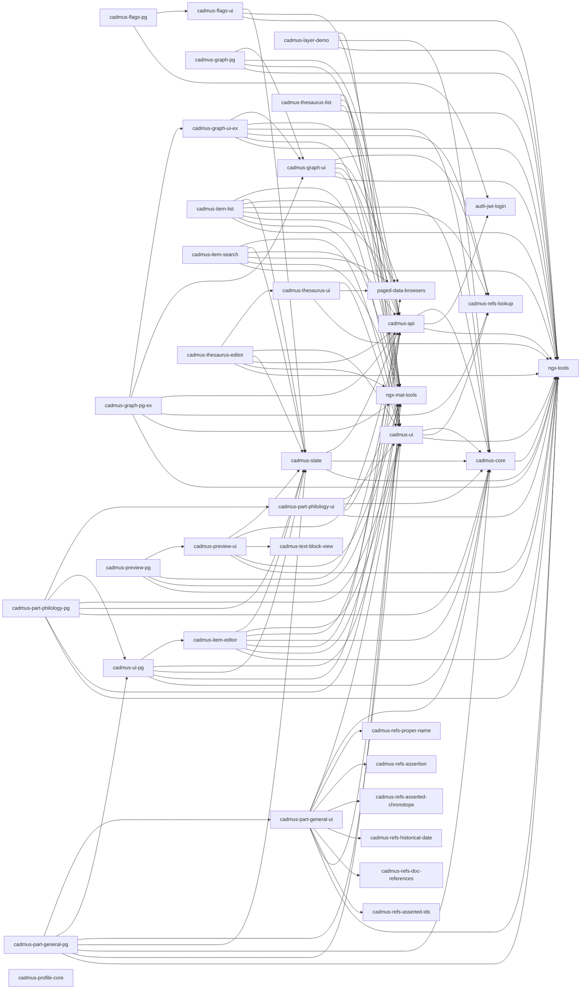

# Cadmus Shell V3

This project was generated using [Angular CLI](https://github.com/angular/angular-cli) version 19.0.6.

This is the third iteration of [Cadmus](https://myrmex.github.io/overview/cadmus) frontend refactoring. This app is used as a shell for developing core UI components and generic part editors. All the libraries in V3 have been bumped to **major version 8**.

1. [original shell app](https://github.com/vedph/cadmus_shell): this was a draft.
2. [version 1](https://github.com/vedph/cadmus-shell): this is obsolete.
3. [version 2](https://github.com/vedph/cadmus-shell-2): this is a production version.
4. version 3 is this version. It has been cloned from V2, with upgrade to [V2 bricks](https://github.com/vedph/cadmus-bricks-shell-v2#migration-from-v1), which affected only a subset of the libraries. Yet, to ensure compatibility I have created a new repository so that existing Cadmus apps can continue to refer to V2 until they upgrade.

🐋 Quick Docker image build:

1. `npm run build-lib`;
2. update version in `env.js` (and Docker files), and then `ng build --configuration=production`;
3. `docker build . -t vedph2020/cadmus-shell:8.0.2 -t vedph2020/cadmus-shell:latest` (replace with the current version).

## Libraries

Latest versions:

- cadmus-api: 12.0.1
- cadmus-core: 11.0.0
- cadmus-flags-pg: 13.0.0
- cadmus-flags-ui: 13.0.0
- cadmus-graph-pg: 13.0.0
- cadmus-graph-pg-ex: 13.0.0
- cadmus-graph-ui: 13.0.0
- cadmus-graph-ui-ex: 13.0.0
- cadmus-item-editor: 13.0.1
- cadmus-item-list: 13.0.0
- cadmus-item-search: 13.0.0
- cadmus-layer-demo: 12.0.0
- cadmus-part-general-pg: 13.0.0
- cadmus-part-general-ui: 12.0.0
- cadmus-part-philology-pg: 13.0.0
- cadmus-part-philology-ui: 12.0.1
- cadmus-preview-pg: 13.0.0
- cadmus-preview-ui: 13.0.0
- cadmus-profile-core: 11.0.0
- cadmus-state: 12.0.0
- cadmus-thesaurus-editor: 13.0.0
- cadmus-thesaurus-list: 13.0.0
- cadmus-thesaurus-ui: 12.0.0
- cadmus-ui: 12.0.0
- cadmus-ui-pg: 13.0.0

Dependencies:



## Setup

This workspace was created with these commands:

```sh
ng new cadmus-shell-v3
cd cadmus-shell-v3
ng add @angular/material
ng add @angular/localize

ng g library @myrmidon/cadmus-api --prefix cadmus --force
ng g library @myrmidon/cadmus-core --prefix cadmus --force
ng g library @myrmidon/cadmus-flags-pg --prefix cadmus --force
ng g library @myrmidon/cadmus-flags-ui --prefix cadmus --force
ng g library @myrmidon/cadmus-graph-pg --prefix cadmus --force
ng g library @myrmidon/cadmus-graph-pg-ex --prefix cadmus --force
ng g library @myrmidon/cadmus-graph-ui --prefix cadmus --force
ng g library @myrmidon/cadmus-graph-ui-ex --prefix cadmus --force
ng g library @myrmidon/cadmus-item-editor --prefix cadmus --force
ng g library @myrmidon/cadmus-item-list --prefix cadmus --force
ng g library @myrmidon/cadmus-item-search --prefix cadmus --force
ng g library @myrmidon/cadmus-layer-demo --prefix cadmus --force
ng g library @myrmidon/cadmus-part-general-pg --prefix cadmus --force
ng g library @myrmidon/cadmus-part-general-ui --prefix cadmus --force
ng g library @myrmidon/cadmus-part-philology-pg --prefix cadmus --force
ng g library @myrmidon/cadmus-part-philology-ui --prefix cadmus --force
ng g library @myrmidon/cadmus-preview-pg --prefix cadmus --force
ng g library @myrmidon/cadmus-preview-ui --prefix cadmus --force
ng g library @myrmidon/cadmus-profile-core --prefix cadmus --force
ng g library @myrmidon/cadmus-state --prefix cadmus --force
ng g library @myrmidon/cadmus-thesaurus-editor --prefix cadmus --force
ng g library @myrmidon/cadmus-thesaurus-list --prefix cadmus --force
ng g library @myrmidon/cadmus-thesaurus-ui --prefix cadmus --force
ng g library @myrmidon/cadmus-ui --prefix cadmus --force
ng g library @myrmidon/cadmus-ui-pg --prefix cadmus --force
```

## History

- 2025-03-09:
  - added features to API preview text span model (`@myrmidon/cadmus-api`).
  - updated Angular.
- 2025-03-06: fix to item editor thesaurus assignment (`@myrmidon/cadmus-item-editor`).

### 13.0.0

- 2025-03-02:
  - ⚠️ refactored **preview** (rendering) components for backend preview V2 (and consequently Cadmus API version 11.x.x). The only relevant change in backend for the preview UI refers to a few endpoints, as most of the refactoring in backend affected the export process for more powerful renditions into TEI etc. The essential change here was replacing the block model with the `TextSpan` model for layered text preview. The related UI components have been modified accordingly, and dependencies from the text view brick have been removed. Also, a few API services for preview have changed to use this model, which implied bumping their major version. In turn, this bumped the major versions of all the dependent libraries, even if their only changes refer to the peer dependencies versions. Finally, in the state library a new function was added to `AppService` for getting the layer color to use in preview UI.
  - updated Angular and packages.

- 2025-02-08: 👉 added editor **settings**:
  - new editor settings service in `@myrmidon/cadmus-api` (11.0.1).
  - new methods `getSetting` and `getSettingFor` added to `AppRepository` in `@myrmidon/cadmus-state` (11.0.1).

Editor **settings** are defined in the backend JSON profile under the root's `settings` property, which is a single object where each property is an object setting: the property name is the setting key, and the property value is the setting value.

By convention, each setting refers to an editor and its ID is the editor's type ID optionally followed by its role ID prefixed by an underscore. For instance, categories editor's settings are under `it.vedph.categories`, and the role-specific settings are under `it.vedph.categories_role`. In MongoDB, each setting is stored as a document in the `settings` collection, with an ID equal to this identifier.

This allows adding specific settings for configurable editors in the UI. Until now, this was possible via thesauri used for this purpose; but this forced settings to be structured as flat string entries, which is not flexible except for simple cases. Now, each editor type (also distinguishing its roles, if required) can have its own settings, and these can be structured as needed in a freely modeled object.

💡 To use this feature in your part or fragment editor:

1. inject the `AppRepository` service.
2. request the setting object for the editor of the part/fragment type ID and role via `getSettingFor(typeId, roleId?)`. This will return an object with any model, representing all the settings for that specific editor. The repository will cache these settings for future requests, thus avoiding further trips to the server.

This being an opt-in feature, no change is required for all the existing editors.

### 12.0.1

- 2025-02-05: increased apparatus entry note limit from 1000 to 5000.

### 12.0.0

- 2025-01-26: ⚠️ migrated to signals with a few BREAKING CHANGES:
  - in `ModelEditorComponentBase` the following properties are now signals, which implies having to read them with `()`: `identity`, `data`, `disabled`. Correspondingly, the ⚠️ `dataChange` event signature has changed; before migrating, the object was `T`; now it is `EditedObject<T>` to align with the corresponding property. This implies a breaking change: whenever you handle `dataChange` you must pass `event$!.value!` rather than just `event$`.
  - while refactoring, the missing parts component was fixed so that now it should correctly report all the missing properties in an item editor, providing a button to add them.
  - fixes to physical measurements part.
  - fixes to physical states part.
  - minor aesthetic improvements.
  - note that the following libraries were not affected by this migration and so their version number did not bump to 12; yet, all the latest versions are meant to work together: `cadmus-core`, `cadmus-api`, `cadmus-profile-core`, `cadmus-state`.

Migration to signals here does not carry a huge impact as all the part/fragment editors do not use input/output properties as they behave like top-level components, being miniature editors for their data model. The migration mostly affected sub-components used by these editors. Yet, it also affected generic libraries, and above all the base component for editors as illustrated above.

### 11.0.0

- 2025-01-02: BREAKING CHANGES:
  - ⚠️ migrated to standalone components.
  - ⚠️ consequently, in [routes](src/app/app.routes.ts) most routes have been updated to load single components (via `loadComponent`) rather than modules (`loadChildren`), except when they have multiple sub-routes like for general and philology parts: so the changes affect routes `demo/layers`, `items/:id`, `items`, `search`, `thesauri/:id`, `thesauri`, `graph`, `flags`.
  - refactored shell app for modern Angular.
  - refactored `AppRepository` to return `Promise` when loading data and avoid reloading if any data has already been loaded, unless you force it (with `load(true)` or by first clearing the repository). This allows lazily loading its data at any point, and avoids [issues](https://github.com/angular/angular/issues/53120) arising from standalone components and singleton services. Correspondingly, all the consumers of this service call `load`(without force) at the right place to ensure that data are loaded.
  - fixed some potential leaks when subscriptions were not unsubscribed on component destroy.
  - added `metadata-names` thesaurus to metadata part.
  - better console error messages.
  - better UI layout in many editors.

### 10.2.2

- 2025-01-01: adjusted some typings after updates for library `@myrmidon/cadmus-part-general-ui`.

### 10.2.1

- 2025-01-01:
  - updated packages.
  - adjusted some typings after updates for libraries `@myrmidon/cadmus-graph-ui`, `@myrmidon/cadmus-graph-ui-ex`, `@myrmidon/cadmus-item-editor`, `@myrmidon/cadmus-item-list`.
- 2024-12-23: better layout in index keywords part.

### 10.2.0

- 2024-12-23:
  - ⚠️ updated to [bricks V3](https://github.com/vedph/cadmus-bricks-shell-v3).
  - removed legacy `color` directive, which was already replaced by classes.
  - fixed user service (new model from API).

### 10.1.0

- 2024-12-21: ⚠️ updated dependencies removing `EnvServiceProvider`. This is no longer required because the new `EnvService` now auto-configures itself from object `window.__env`.

### 10.0.0

- 2024-12-02: ⚠️ updated dependencies:
  - ngx-tools and ngx-mat-tools; the old libraries are ng-tools and ng-mat-tools. The new one has the correct name according to Angular conventions.
  - ngx-data-browser;
  - authjwt;
  - bricks.

All these dependencies have been refactored and their major version has been increased, in order to lay the foundation for a more general modernization of the codebase. These being the lowest layers of the frontend, they have been refactored as a first stage. Next stages will involve a progressive refactoring of the libraries in bricks, then in this shell, and finally of all the single Cadmus projects. The modernization refers to:

1. migrate to standalone: `ng generate @angular/core:standalone`. This usually requires to manually define the imports of each component. Also, most of the work is then spent in changing the consumer code, which needs to import components at a more granular level.
2. migrate dependency injection to function-based paradigm: `ng generate @angular/core:inject`. This usually is trivial.
3. migrate properties from decorators to signal-based: `ng generate @angular/core:signals --insert-todos`. This is the step requiring most work, because the schematics are applied only to a minor subset of trivial cases. All the others must be manually refactored into signals: `input` or `model` for properties, `output` for events; the corresponding code and template must be updated so that whenever it reads a signal it calls a function, and whenever it writes it either sets it via output if it's an input, or uses a `model`.

Currently the libraries listed above except bricks were fully migrated (points 1-3); bricks instead were just updated for their dependencies for the listed libraries; and finally, here all the libraries have been updated for their dependencies on these libraries and on bricks.

### 9.0.2

- 2024-11-29: updated `@myrmidon/cadmus-core` to add `isAdmin` to flag definitions.
- 2024-11-22: updated some peer dependencies.

### 9.0.0

- 2024-11-22: ⚠️ upgraded to Angular 19 and updated packages except for `@swimlane/ngx-graph` whose version 9 has [issues](https://github.com/swimlane/ngx-graph/issues/559) when loading a zero nodes graph. Until the fix is merged, we will stick to version 8.4.0.
- 2024-11-21: fix to district location part.
- 2024-11-18:
  - updated Angular.
  - changed port number in `env.js` so that it fits the API http development port.
- 2024-10-30:
  - updated Angular and packages.
  - added district location part.
- 2024-09-29: fix to flags editor.
- 2024-09-28: affected libraries: `@myrmidon/cadmus-api`, `@myrmidon/cadmus-item-editor`, `@myrmidon/cadmus-item-list`:
  - added generate items feature in item editor. This allows using the edited item as a template to generate a specific number of new items. When using this feature, it may be a good idea having a flag marking items used as pure templates, and another one marking generated items, so you can be sure to edit them after their generation.
  - added copy to item feature in item editor. This allows copying any part of the edited item into another item, provided that the target item does not already have such a part with that role. Items must belong to the same facet.
  - added messaging service for inter-component notifications. This is used when generating new items, so that the items list is reset after generation.
- 2024-08-09: note layout: preview side by side.

### 8.1.3

- 2024-07-17:
  - updated Angular and packages.
  - added new general parts: decorated counts, physical measurements, physical states (`@myrmidon/cadmus-part-general-ui`, `@myrmidon/cadmus-part-general-pg`).
  - [refactored Gravatar](https://myrmex.github.io/overview/cadmus/dev/history/f-gravatar)
- 2024-06-09:
  - applied [M3 theme](https://material.angular.io/guide/theming).
  - minor aesthetic changes in some libraries.

### 8.1.2

- 2024-06-07:
  - added `class="mat-X"` for each `color="X"` (e.g. `class="mat-primary"` wherever there is a `color="primary"`) to allow transitioning to Angular Material M3 from M2. This also implies adding it directly to the target element, so in the case of `mat-icon` inside a `button` with `color` the class is added to `mat-icon` directly (unless the button too has the same color). This allows to keep the old M2 clients while using the new M3, because it seems that the compatibility mixin is not effective in some cases like inheritance of `color`, and in the future `color` will be replaced by `class` altogether.
  - changed `h2` to `h3` (`h2` is too big in M3).
  - better styles for item editor.
- 2024-06-05:
  - added opt-in for role-dependent thesauri for external IDs part in `@myrmidon/cadmus-part-general-pg`.
  - updated packages.

### 8.1.1

- 2024-05-25:
  - updated packages.
  - added property to `@for` track where possible.

### 8.1.0

- 2024-05-23:
  - ⚠️ updated to Angular 18.
  - bumped all the library versions to 8.1.0 and updated their peer dependencies for Angular 18.
  - migrated to new control flow syntax via `ng g @angular/core:control-flow`.
  - removed `@myrmidon/ngx-dirty-check` package, replacing it with an implementation based on Angular 18 `AbstractControl`'s `events`. This just listens for changes of the pristine state in the root editor form, and updates the dirty property while also emitting the corresponding event.
- 2024-05-22: updated packages and Angular.
- 2024-05-14: updated packages and Angular.
- 2024-05-02: added plugins support to note editor.

### 8.0.2

- 2024-04-30:
  - updated packages.
  - Docker compose fixes.

### 8.0.1

- 2024-04-30:
  - added plugins support to comment editor.
  - updated Angular.
- 2024-04-13: **V3 shell**:
  - migrated to [V2 bricks](https://github.com/vedph/cadmus-bricks-shell-v2#migration-from-v1). All the libraries of V2 repository start from version number 5.x.x and have dropped modules, thus using standalone components, directives, and pipes.
  - ⚠️ replaced `ngx-monaco-editor-v2` and `ngx-markdown` with NG essentials, affecting:
    - `@myrmidon/cadmus-part-general-ui` and `@myrmidon/cadmus-part-general-pg` (for comment, note, token text). These were bumped to version 8.0.0.
    - `@myrmidon/cadmus-part-philology-ui` and `@myrmidon/cadmus-part-philology-ui` (for witnesses). These were bumped to version 8.0.0.
    - `@myrmidon/cadmus-ui`: here Monaco dependency was no longer needed and has been removed.

- 2024-03-23:
  - ⚠️ removed rangy replaced with vanilla JS (`@myrmidon/cadmus-core` bumped to major version 7.0.0). This removes a legacy depenency which also caused issues in newer Angular 17-based apps.
  - added `forChild` to `MarkdownModule` in general and philology parts (`@myrmidon/cadmus-part-general-ui`, `@myrmidon/cadmus-part-philology-ui`).
- 2024-03-21:
  - updated Angular and packages.
  - ⚠️ replaced `ngx-monaco-editor` with [ngx-monaco-editor-v2](https://github.com/miki995/ngx-monaco-editor-v2).
  - updated version for `@myrmidon/cadmus-ui` (6.0.1), `@myrmidon/cadmus-part-general-ui` (7.0.1), `@myrmidon/cadmus-part-philology-ui` (6.0.1) affected by Monaco editor change.
- 2023-11-21:
  - added optional `settings` to `PartDefinition` and honored the optionality of other properties in it. This way, your editor can now access part definition settings for editors via `AppRepository`. Affected libraries: `@myrmidon/cadmus-api`, `@myrmidon/cadmus-core`, `@myrmidon/cadmus-item-editor`, `@myrmidon/cadmus-item-search`.
- 2023-11-17:
  - more load methods added to app state (`@myrmidon/cadmus-state`).
  - update app state flags on flags saved (`@myrmidon/cadmus-flags-ui`).
  - update app state thesauri on thesauri saved (`@myrmidon/cadmus-thesaurus-editor`).

---

### 7.0.0

- 2023-11-09: ⚠️ upgraded to Angular 17.
- 2023-11-06: added **flags editor** route and page. To opt in to use a flags editor:

1. `npm i @myrmidon/cadmus-flags-ui @myrmidon/cadmus-flags-pg --force`
2. add this route to your app routes:

```ts
// cadmus - flags
{
  path: 'flags',
  loadChildren: () =>
    import('@myrmidon/cadmus-flags-pg').then(
      (module) => module.CadmusFlagsPgModule
    ),
},
```

3. add a menu for that route in `app.component.html` (flags editing is reserved to admin users only), e.g. (including thesauri and flags in the same menu):

```html
<!-- profile menu -->
<ng-container *ngIf="user && (user.roles.includes('admin') || user.roles.includes('editor'))">
  <button type="button" mat-button [matMenuTriggerFor]="profileMenu">
    Profile
  </button>
  <mat-menu #profileMenu>
    <a mat-menu-item routerLink="/flags"> Flags </a>
    <a mat-menu-item routerLink="/thesauri"> Thesauri </a>
  </mat-menu>
</ng-container>
```

- 2023-11-04: added `addFlags` to API service.

- 2023-10-31:
  - updated Angular and packages.
  - fixed missing `@Output` decorator in an event in a thesaurus list component.
  - removed legacy options (hash navigation) from router config:

```ts
RouterModule.forRoot(routes, {
  initialNavigation: 'enabledBlocking',
  useHash: true,
}),
```

- 2023-10-05:
  - updated Angular.
  - updated packages (`@myrmidon/cadmus-graph-ui-ex`).
- ⚠️ 2023-10-03: removed ELF dependencies. For trivial repositories like this, we can dispose of more powerful libraries and just use vanilla Angular. This makes the UI more robust and easier to use for newcomers.
  - updated Angular and packages.
  - refactored `@myrmidon/cadmus-graph-ui` (bumped to 6.0.0) to replace ELF with simpler repository from `@myrmidon/paged-data-browsers`.
  - refactored `@myrmidon/cadmus-item-editor` (bumped to 6.0.0) to replace ELF with simpler repository from `@myrmidon/paged-data-browsers`.
  - refactored `@myrmidon/cadmus-item-list` (bumped to 6.0.0) to replace ELF with simpler repository from `@myrmidon/paged-data-browsers`.
  - refactored `@myrmidon/cadmus-item-search` (bumped to 6.0.0) to replace ELF with simpler repository from `@myrmidon/paged-data-browsers`.
  - refactored `@myrmidon/cadmus-thesaurus-list` (bumped to 6.0.0) to replace ELF with simpler repository from `@myrmidon/paged-data-browsers`.
  - refactored `@myrmidon/cadmus-state` (bumped to 6.0.0) to replace ELF with simpler repository from `@myrmidon/paged-data-browsers`.
  - refactored `@myrmidon/cadmus-thesaurus-ui` (bumped to 6.0.0) to replace ELF with simpler repository from `@myrmidon/paged-data-browsers`.
  - refactored `@myrmidon/cadmus-ui-pg` (bumped to 6.0.0) to replace ELF with simpler repository from `@myrmidon/paged-data-browsers`.
- 2023-09-28: enabled download in thesaurus list even when import setting is not enabled.

### 6.0.2

- 2023-09-24:
  - added upload service to `@myrmidon/cadmus-api`.
  - added thesaurus download and thesauri import to thesaurus list in `@myrmidon/cadmus-thesaurus-list`. Note that for importing you must opt-in by setting an env variable like this: `window.__env.thesImportEnabled = true;`. At any rate, import is available only to admin users. To enable import on the server side, be sure to import `Cadmus.Api.Controllers.Import` in your API project.
  - fixes to list layout in `@myrmidon/cadmus-item-list`.
  - fixes to list layout in `@myrmidon/cadmus-item-search`.
  - fixes to list layout in `@myrmidon/cadmus-graph-ui`.
- 2023-09-22:
  - updated Angular and packages.
  - added method `getItemGroupIds` to item service in `@myrmidon/cadmus-api`.
- 2023-09-04: updated Angular.
- 2023-07-17:
  - updated packages.
  - set default internal link for most asserted composite IDs used in general parts (except comments).
- 2023-07-05:
  - added `noErrIfNotFound` for item service `getPartFromTypeAndRole`.
  - added `noErrIfNotFound` for item service `getItem`.
- 2023-07-01: updated Angular.
- 2023-06-23: more controls for triple literal (`@myrmidon/cadmus-graph-ui@5.0.3`).

### 6.0.1

- 2023-06-16:
  - updated Angular.
  - refactored Docker compose script for PostgreSQL.
- 2023-05-26:
  - fix default facet in new item.
  - removed stale code from events.
  - refactored event editor for related entities.
- 2023-05-25: fix validation in triple editor (conditional validator did not work because control value was not up to date when evaluating).

### 6.0.0

- ⚠️ 2023-05-22: breaking changes for parts using the new [asserted composite ID](https://github.com/vedph/cadmus-bricks-shell/blob/master/projects/myrmidon/cadmus-refs-asserted-ids/README.md#asserted-composite-id):
  - refactored _pin links part_ and _pin links fragment_ (`@myrmidon/cadmus-part-general-ui`, `@myrmidon/cadmus-part-general-pg`: bump version to 6.0.0): links are now of type `AssertedCompositeId` (from bricks).
  - refactored related entity ID for _historical events part_: ID now is an `AssertedCompositeId` rather than a string.
  - refactored comments for _comments part and fragment_: `externalIds` (an array of items of type `AssertedId`) now is `links`, an array of items of type `AssertedCompositeId`.

### 5.0.0

- 2023-05-19:
  - preserve content for graph page in `CadmusGraphPgEx`.
  - added move to source capability to `CadmusGraphPgEx`.
- 2023-05-16: updated source type filters in graph UI (`@myrmidon/cadmus-graph-ui`).
- 2023-05-11: updated to Angular 16.
- 2023-04-28: added `this.roleIdInThesauri = true;` to comment, names, and note parts.
- 2023-04-21: added `this.roleIdInThesauri = true;` to the historical events part, thus enabling it to have role-dependent thesauri like the categories part.

### 4.1.0

- 2023-03-11:
  - moved imaging parts (gallery image annotations part) out of general parts into its own library, removing unnecessary packages from this demo.
  - better UI layout in categories and index keywords.
- 2023-03-07: updated packages.

### 4.0.12

- 2023-03-02:
  - added gallery image annotations part, using the [image gallery bricks](https://github.com/vedph/cadmus-bricks-shell/blob/master/projects/myrmidon/cadmus-img-gallery/README.md). In the demo shell I added new modules (`CadmusImgAnnotatorModule`, `CadmusImgGalleryModule`) and an `img_anno_eid` index lookup definition to let users play with references to image annotations via EID. Also, the gallery requires additional injection providers in `app.module`, and the following libraries:
    - `@myrmidon/cadmus-img-annotator` (brick)
    - `@myrmidon/cadmus-img-gallery` (brick)
    - `@recogito/annotorious` which also requires adding CSS to `angular.json`.
  - updated Angular.
- 2023-02-27:
  - added `tag` to historical event.
  - added feature: role ID suffix for thesauri (in `edit-part-feature-base.ts`): this is a new opt-in mechanism by which a part can request its thesauri IDs to be suffixed by its role ID (preceded by underscore). The categories part now opts into this new mechanism, so that you can have multiple categories parts each with its own, distinct set of categories. To opt in, just add `this.roleIdInThesauri = true;` in your feature component constructor: the part will then request suffixed thesauri. For instance, the categories part, which requests a `categories` thesaurus, when having a role equal to `eras` will rather request a `categories_eras` thesaurus to the server. Still, the returned set key will not change: its name will still be `categories`, so that the part code is not broken, but in fact the content of the thesaurus was got from `categories_eras` (which is still the ID of the thesaurus keyed under `categories`). If some of the requested thesauri need not to change, just add an alias thesaurus with the role suffix, pointing to the original thesaurus.
- 2023-02-26: multiple chronotopes in historical event (`@myrmidon/cadmus-part-general-ui`).
- 2023-02-24: added pin links fragment layer (`@myrmidon/cadmus-part-general-ui` and (`@myrmidon/cadmus-part-general-pg`)).
- 2023-02-22:
  - updated Angular.
  - fix to event editor: relation reset when picking lookup item (`@myrmidon/cadmus-part-general-ui`).
- 2023-02-17:
  - edited node as a bindable property in graph node list (`@myrmidon/cadmus-graph-ui`).
  - refactored API graph service (`@myrmidon/cadmus-api`).
  - replaced graph lookup component with the generic lookup brick (`@myrmidon/cadmus-graph-ui`; added `GraphNodeLookupService`).
- 2023-02-15: added optional `tag` to pin links part entries (`@myrmidon/cadmus-part-general-ui` and `@myrmidon/cadmus-part-general-pg`).

### 4.0.11

- 2023-02-15: improvements to graph UI.
- 2023-02-14:
  - updated Angular and packages.
  - clear user list cache on new registered user in `RegisterUserPageComponent`.
- 2023-02-07:
  - fix to chronotopes part.
  - use contrast color in Th-Scopes tab in item editor.
  - cut tail `.-` in filtering related event thesauri.

### 4.0.10

- 2023-02-06: changes to binding in bibliography-entry; chronotopes-part; comment-editor; doc-references-part; external-ids-part; historical-date-part; historical-event-editor; index-keyword; tiled-data; quotation-entry. These reflect the new bricks (mostly assertions or chronotopes), whose binding has been fixed so that now the initial-property hack is no more required.
- 2023-02-03:
  - fixed a label in chronotopes part.
  - updated packages and Angular.
- 2023-02-01: fixed a label in `@myrmidon/cadmus-graph-ui`.

### 4.0.9

- 2023-01-25: minor refactorings in historical event editor.
- 2023-01-24: added lookup to historical event editor. To test this, just add an `eid` metadatum to an item's metadata part, and then in another item events part refer to its value via lookup.
- 2023-01-22: changed historical events part related events thesaurus so that it uses `:` as separator.
- 2023-01-20: updated Angular and packages.
- 2023-01-17:
  - fix null in comment editor `getValue`.
  - added `TextLayerService.getTextFragment` to be used by orthography layer when comparing the original with the standard form.
  - added `frText` display to all the layer fragment editors requiring it (orthography, apparatus, quotations, witnesses).
- 2023-01-16: updated Angular and packages.
- 2023-01-05: added more methods to `ColorService` in `@myrmidon/cadmus-ui` (getting them from `cadmus-show-app`).

### 4.0.8

- 2022-12-22:
  - fix to thesaurus editor validation (`@myrmidon/cadmus-thesaurus-ui`).
  - upgraded Monaco editor changing the glob in `angular.json` to:

```json
{
  "glob": "**/*",
  "input": "node_modules/monaco-editor",
  "output": "assets/monaco-editor"
}
```

- 2022-12-19:
  - added lookup pipe to event relations list in historical event editor (`@myrmidon/cadmus-part-general-ui`).
  - updated packages.
- 2022-12-15:
  - added `flatLookup` pipe to event type in part editor (`@myrmidon/cadmus-part-general-ui`).
  - updated Angular.
  - aesthetics for philology parts, thesaurus list and UI (`@myrmidon/cadmus-part-philology-ui`, `@myrmidon/cadmus-thesaurus-list`, `@myrmidon/cadmus-thesaurus-ui`).

### 4.0.7

- 2022-12-22: fixed missing label in thesaurus add node button (`@myrmidon/cadmus-thesaurus-ui`).
- 2022-12-15: fixes:
  - wrong available parts list after saving a new item with a facet not equal to the default one (`@myrmidon/cadmus-item-editor`).
  - refresh in items list did not reload page 1 (`@myrmidon/cadmus-item-list`).
- 2022-12-14: fixed label position for note in `@myrmidon/cadmus-part-general-ui`.

### 4.0.6

- 2022-12-14:
  - updated Angular.
  - minor compilation fixes in item editor and item list.

### 4.0.5

- 2022-12-03:
  - fixed flags not displayed correctly in item editor.
  - fixed item list not in synch after item saved from editor.
  - export repositories from item list and thesaurus list.
  - changed input of flags and facets badge so that both definitions and value are input at the same time.

### 4.0.4

- 2022-12-02:
  - added repository reset to layer editors when initing them.
  - added thesaurus to orthography tags.

### 4.0.3

- 2022-12-02: fixed identity update on saving new part not reflected in editor's data (`@myrmidon/cadmus-state`, `@myrmidon-cadmus-ui`).

### 4.0.2

- 2022-12-01: updated packages.

### 4.0.1

- 2022-11-30:
  - fixes to `@myrmidon/cadmus-ui` and `@myrmidon/cadmus-state` for newly created parts.
  - allow `null` in `updateForm` part/fragment editors to make TS compiler happy.

### 4.0.0

- 2022-11-30:
  - **breaking change**: renamed thesaurus `categories` as `comment-categories` for comment part/fragment. This allows using different categories for comments and categories parts. Should you need to use the same categories, just create a thesaurus alias.
  - removed `@angular/flex-layout` from `@myrmidon/cadmus-graph-ui`, `@myrmidon/cadmus-item-editor`, `@myrmidon/cadmus-item-list`, `@myrmidon/cadmus-item-search`, `@myrmidon/cadmus-thesaurus-list`, `@myrmidon/cadmus-thesaurus-ui`, tiled text layer part and token text layer part.
  - removed `@angular/flex-layout` package from app.
- 2022-11-25: added `PinLinksPart`.
- 2022-11-24:
  - minor fixes to `@myrmidon/cadmus-item-list` and `@myrmidon/cadmus-ui`.
  - `@myrmidon/cadmus-item-editor`: wider buttons space.
  - removed `CadmusValidators` (they are now under `@myrmidon/ng-tools` as `NgxToolsValidators`)
- 2022-11-08:
  - updated Angular.
  - changed prefix building in historical event editor.
  - added lookup pipe to selected event type in historical event editor.

The following history refers to version 1.

### 3.1.5

- 2022-11-03:
  - updated Angular and packages.
  - fixes to events editor.
  - hierarchical thesauri for events and relations in events editor. When specified, selecting an event type triggers filtering of relations according to the selected ID prefix. This is equal to the ID of the selected entry up to the last dot, i.e. from event type `person.crm:E67_birth` we filter all the relation entries starting with `person.`. This allows different granularity levels in filtering: for instance, should we have `person.birth.crm:E67_birth` (prefix `person.birth.`), we could have two relation entries `person.birth.P96_by_mother` and `person.birth.P97_from_father`, which are available only when a person's birth event is selected (rather than just a person's event). If no thesauri are specified, you can just fill the IDs without constraints.

### 3.1.4

- 2022-10-25:
  - in `@myrmidon/cadmus-core` fix to `textLayerService.selHasAnySpan`: check for SPAN element did not stop when adding a new selection and another selection in the context of the same ancestor is found after the insertion point.
  - updated `rangy` to 1.3.1.
  - updated Angular.

### 3.1.3

- 2022-10-10:
  - preview samples fixes.
  - updated Angular.

### 3.1.2

- 2022-10-04:
  - changed two endpoint addresses in preview API service. This affected `@myrmidon/cadmus-api` and `@myrmidon/cadmus-preview-ui`.
  - updated Angular.
  - added styles for apparatus preview.
- 2022-09-14: updated Angular.

### 3.1.1

- 2022-08-21: added matching mode to flags in items filter, API service, and core models. Now items can be filtered by flags not only by looking at all the flags set, but also to any flag set, all flags clear, and any flags clear. Affected libraries:
  - cadmus-core
  - cadmus-api
  - cadmus-state
  - cadmus-item-list
  - cadmus-item-editor
- 2022-08-08:
  - added preview service to `cadmus-api` and increased its version number.
  - added preview keys to app state in `cadmus-state` and increased its version number.
  - added preview button in item editor when preview is available (`cadmus-item-editor`).
  - replaced deprecated `substr` with `substring` in the above libraries and in `cadmus-core`, `cadmus-part-general-ui`, `cadmus-profile-core`, `cadmus-thesaurus-ui`, `cadmus-ui`, `cadmus-ui-pg`, `cadmus-graph-pg` increasing their version numbers.
  - added `cadmus-preview-ui` and `cadmus-preview-pg`.
- 2022-08-07: updated Angular.
- 2022-08-05: thesauri names for proper names/chronotopes.

### 3.1.0

- 2022-08-04: replaced `ExternalId` with `AssertedId` in comments and removed dependency from `@myrmidon/cadmus-refs-external-ids` (in `cadmus-part-general-ui` and `cadmus-part-general-pg`).
- 2022-08-02: fixes to `HistoricalEventEditor` and `NamesPartComponent`. Minor fix to `ThesaurusTreeComponent` template (removed redundant `?`).
- 2022-07-30: raised length limits for apparatus fragment notes.
- 2022-07-19: historical event editor fixes.
- 2022-07-14: updated Angular.
- 2022-07-10: updated Angular.

### 3.0.0

- 2022-06-11: upgraded to Angular 14; refactored all the forms (except those related to lookups) to typed.
- 2022-05-31: updated API version in Docker scripts.

- 2022-05-21:
  - upgraded Angular.
  - fixed historical events chronotope visualization in events list (`cadmus-part-general-ui`).

### 2.0.3

- 2022-04-29:
  - upgraded Angular to 13.3.5.
  - fixed item editor flags on logout/login.
  - fixed item search layout.
- 2022-03-19: removed moment and fixes to metadata part editor. Libraries affected: cadmus-item-editor, cadmus-item-list, cadmus-item-search, cadmus-part-general-ui, cadmus-ui.

### 2.0.1

- 2022-03-10: upgraded Angular to 13.2.6.
- added in `tsconfig.json` `"allowSyntheticDefaultImports": true` in order to work around [this issue](https://github.com/urish/ngx-moment/issues/275) in `ngx-moment`.

### 2.0.0

- 2022-03-01: upgraded Angular to 13.2.4.
- 2022-02-13: `ModelEditorComponentBase`: internally access `model` via private member rather than property setter/getter. Using the setter would unnecessarily trigger `onModelSet`.
- 2022-01-31: removed `DocReference`, `PhysicalDimension` and `PhysicalSize` interfaces from models (these are now in bricks). Upgraded Angular to 13.2.0.
- 2022-01-16: added `ChronotopesPart` to `cadmus-part-general-ui` and `cadmus-part-general-pg`. Image: 2.0.1.
- 2022-01-04: added `MetadataPart` to `cadmus-part-general-ui` and `cadmus-part-general-pg`. Removed physical size from `cadmus-ui` (now moved to bricks), increasing `cadmus-ui` version to 2.0.0.
- 2021-12-20: upgraded Angular and fixed ID passed via `getItemLayerInfo` in state library.
- 2021-12-18: recreated an Angular 13.0.4 workspace and moved old shell libraries into it while refactoring:
  - auth-related libraries replaced with `@myrmidon/auth-jwt-login` and `@myrmidon/auth-jwt-admin`.
  - base model editor slightly refactored to use new services.
  - generic models and their editors replaced with bricks.
  - comment part and fragment now uses `ExternalId`'s for IDs rather than an array of strings. This is also reflected in the backend models (`Cadmus.Parts` from version 2.7.0, `Cadmus.Seed.Parts` from version 1.5.0).
  - Cadmus material removed, and replaced by more granular imports in each Material consumer.
