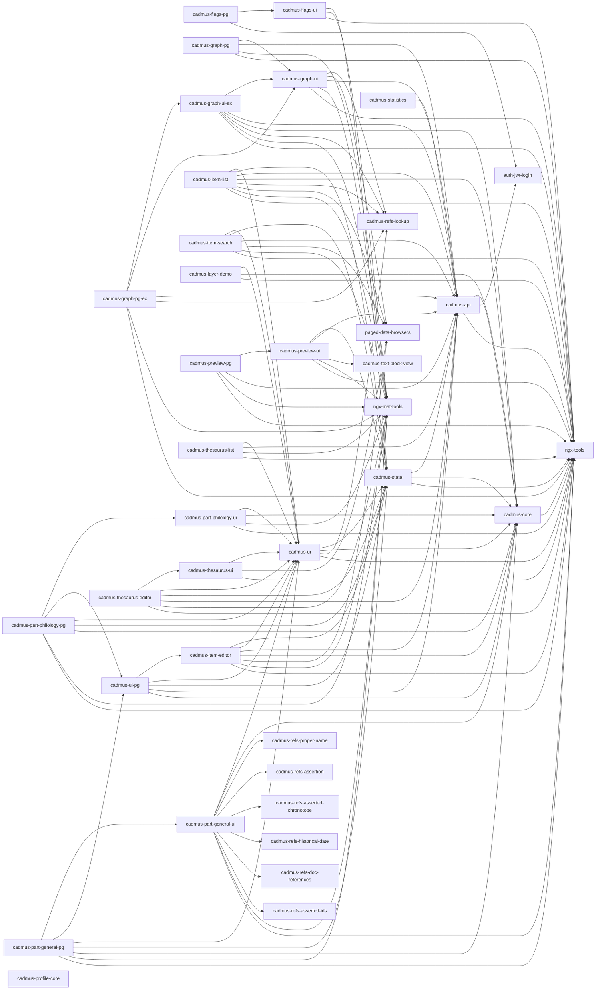

# Cadmus Shell V3

This project was generated using [Angular CLI](https://github.com/angular/angular-cli) version 19.0.6.

This is the third iteration of [Cadmus](https://myrmex.github.io/overview/cadmus) frontend refactoring. This app is used as a shell for developing core UI components and generic part editors. All the libraries in V3 have been bumped to **major version 8**.

1. [original shell app](https://github.com/vedph/cadmus_shell): this was a draft.
2. [version 1](https://github.com/vedph/cadmus-shell): this is obsolete.
3. [version 2](https://github.com/vedph/cadmus-shell-2): this is a production version.
4. version 3 is this version. It has been cloned from V2, with upgrade to [V2 bricks](https://github.com/vedph/cadmus-bricks-shell-v2#migration-from-v1), which affected only a subset of the libraries. Yet, to ensure compatibility I have created a new repository so that existing Cadmus apps can continue to refer to V2 until they upgrade.

🐋 Quick **Docker** image build:

1. `pnpm run build-lib`;
2. update version in `env.js` (and Docker files), and then `ng build --configuration=production`;
3. `docker build . -t vedph2020/cadmus-shell:17.0.0 -t vedph2020/cadmus-shell:latest` (replace with the current version).

## Libraries

Latest versions:

- cadmus-api: 14.0.5
- cadmus-core: 12.0.3
- cadmus-flags-pg: 15.0.2
- cadmus-flags-ui: 15.0.2
- cadmus-graph-pg: 15.0.2
- cadmus-graph-pg-ex: 16.0.1
- cadmus-graph-ui: 15.0.1
- cadmus-graph-ui-ex: 16.0.1
- cadmus-item-editor: 16.0.1
- cadmus-item-list: 16.0.2
- cadmus-item-search: 16.0.1
- cadmus-layer-demo: 15.0.1
- cadmus-part-general-pg: 16.0.5
- cadmus-part-general-ui: 16.0.2
- cadmus-part-philology-pg: 16.1.3
- cadmus-part-philology-ui: 17.0.0
- cadmus-part-taxo-pg: 0.0.1
- cadmus-part-taxo-ui: 0.0.2
- cadmus-preview-pg: 17.0.1
- cadmus-preview-ui: 17.0.3
- cadmus-profile-core: 12.0.1
- cadmus-state: 14.0.4
- cadmus-statistics: 1.0.2
- cadmus-thesaurus-editor: 16.0.1
- cadmus-thesaurus-list: 16.0.1
- cadmus-thesaurus-ui: 15.0.1
- cadmus-ui: 16.0.0
- cadmus-ui-pg: 16.0.1

Dependencies:



### Parts

Most of the libraries in this workspace contain infrastructure logic for Cadmus frontend apps, except for those libraries representing data items parts of general usage:

- `@myrmidon/cadmus-part-general-ui`: general purpose part editors.
- `@myrmidon/cadmus-part-general-pg`: wrappers for general purpose part editors.
- `@myrmidon/cadmus-part-philology-ui`: philology-related generic parts.
- `@myrmidon/cadmus-part-philology-pg`: wrappers for philology-related generic parts.

Often, these parts use UI widgets from [Cadmus bricks](https://github.com/vedph/cadmus-bricks-shell-v3).

## Workspace Setup

This workspace was created with these commands:

```sh
ng new cadmus-shell-v3
cd cadmus-shell-v3
ng add @angular/material
ng add @angular/localize

ng g library @myrmidon/cadmus-api --prefix cadmus --force
ng g library @myrmidon/cadmus-core --prefix cadmus --force
ng g library @myrmidon/cadmus-flags-pg --prefix cadmus --force
ng g library @myrmidon/cadmus-flags-ui --prefix cadmus --force
ng g library @myrmidon/cadmus-graph-pg --prefix cadmus --force
ng g library @myrmidon/cadmus-graph-pg-ex --prefix cadmus --force
ng g library @myrmidon/cadmus-graph-ui --prefix cadmus --force
ng g library @myrmidon/cadmus-graph-ui-ex --prefix cadmus --force
ng g library @myrmidon/cadmus-item-editor --prefix cadmus --force
ng g library @myrmidon/cadmus-item-list --prefix cadmus --force
ng g library @myrmidon/cadmus-item-search --prefix cadmus --force
ng g library @myrmidon/cadmus-layer-demo --prefix cadmus --force
ng g library @myrmidon/cadmus-part-general-pg --prefix cadmus --force
ng g library @myrmidon/cadmus-part-general-ui --prefix cadmus --force
ng g library @myrmidon/cadmus-part-philology-pg --prefix cadmus --force
ng g library @myrmidon/cadmus-part-philology-ui --prefix cadmus --force
ng g library @myrmidon/cadmus-part-taxo-ui --prefix cadmus --force
ng g library @myrmidon/cadmus-part-taxo-pg --prefix cadmus --force
ng g library @myrmidon/cadmus-preview-pg --prefix cadmus --force
ng g library @myrmidon/cadmus-preview-ui --prefix cadmus --force
ng g library @myrmidon/cadmus-profile-core --prefix cadmus --force
ng g library @myrmidon/cadmus-state --prefix cadmus --force
ng g library @myrmidon/cadmus-statistics --prefix cadmus --force
ng g library @myrmidon/cadmus-thesaurus-editor --prefix cadmus --force
ng g library @myrmidon/cadmus-thesaurus-list --prefix cadmus --force
ng g library @myrmidon/cadmus-thesaurus-ui --prefix cadmus --force
ng g library @myrmidon/cadmus-ui --prefix cadmus --force
ng g library @myrmidon/cadmus-ui-pg --prefix cadmus --force
```

- ⌛ [history](CHANGELOG.md)
